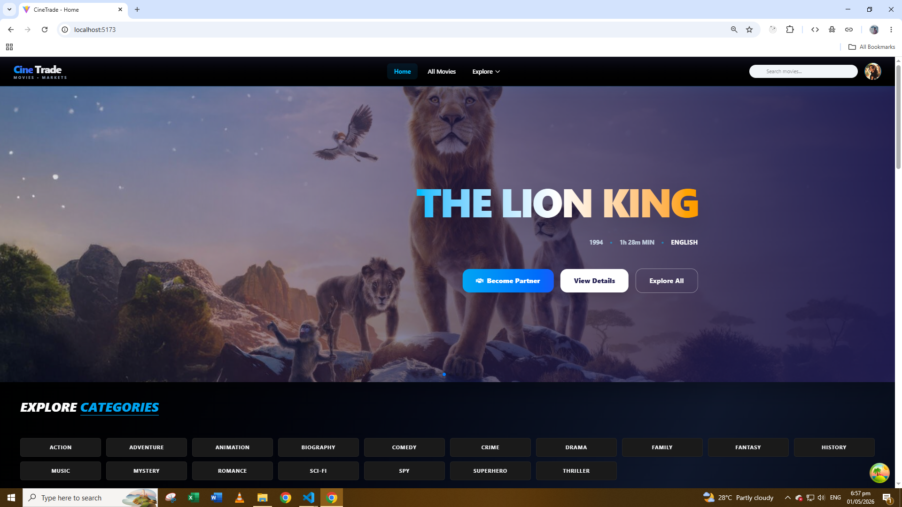
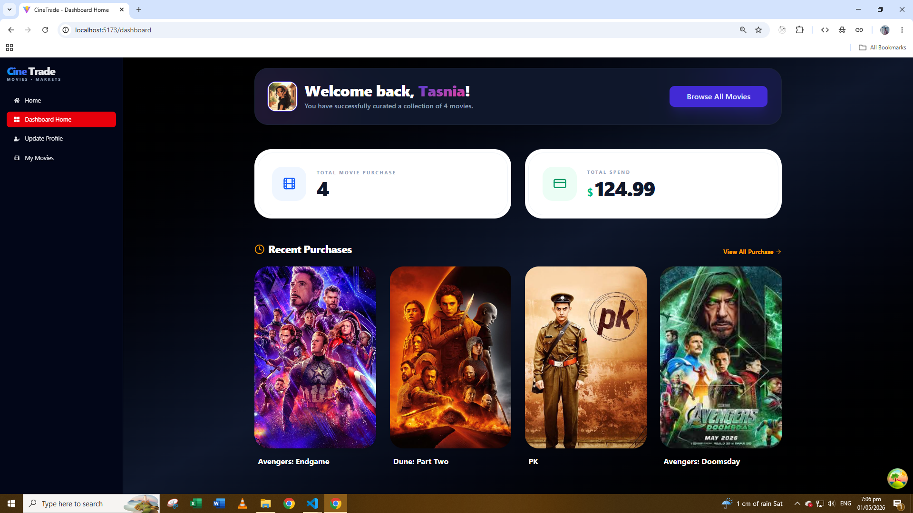
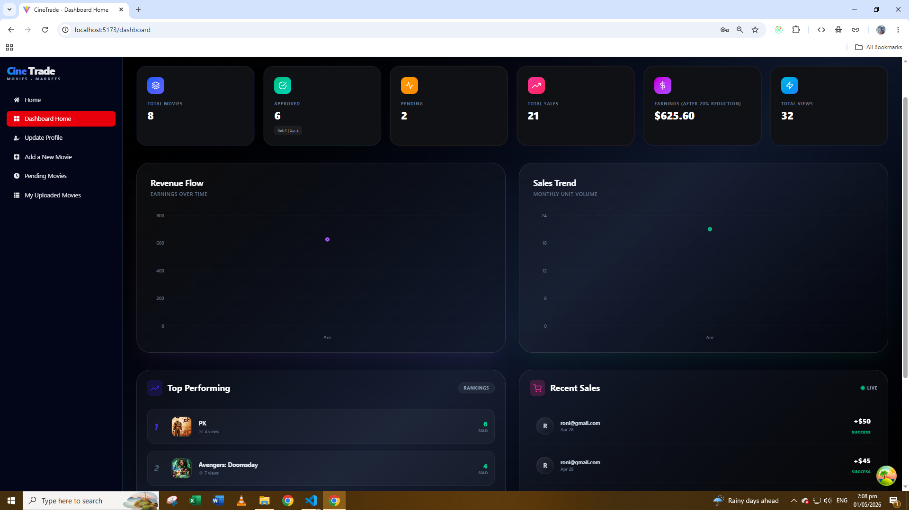
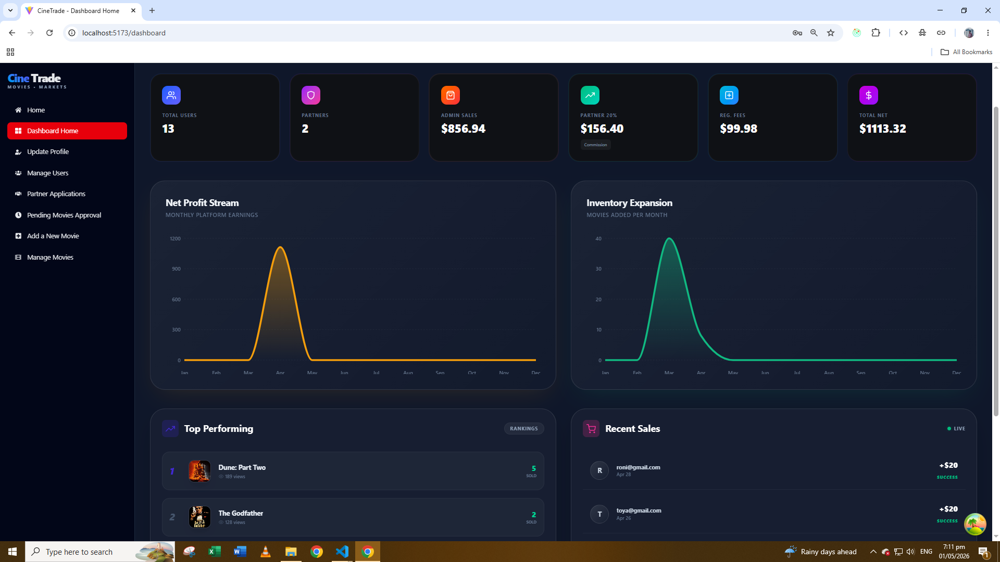
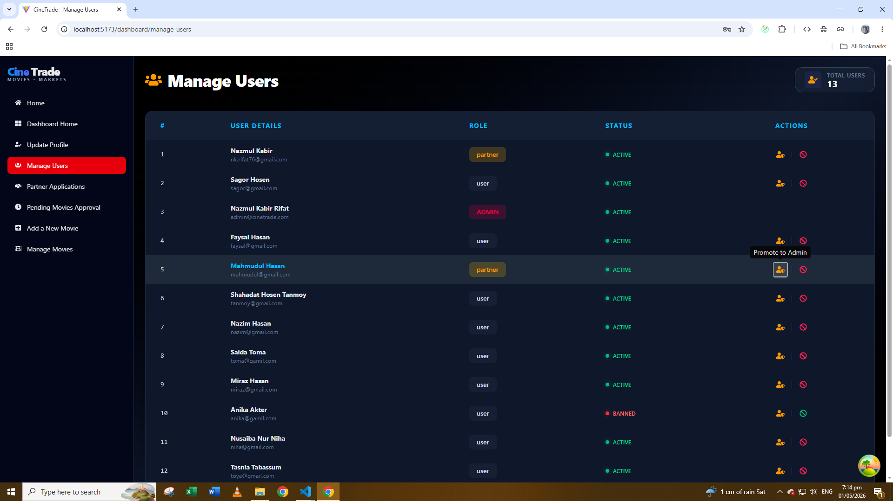
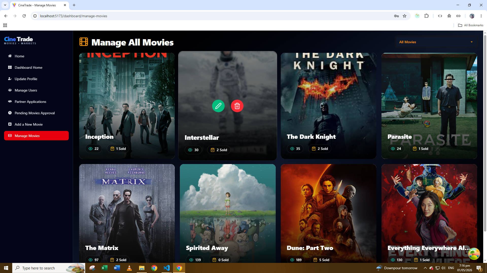

# 🎬 CineTrade | Full-Stack Movie Marketplace

**CineTrade** is a sophisticated, role-based digital commerce platform designed for the movie industry. It provides a secure ecosystem where enthusiasts can purchase content, creators can monetize their work through a partner program, and administrators can oversee the entire marketplace with granular control.

---

## 🔗 Project Resources

- **Live Application:**
- **Client-Side Source:** [CineTrade-Client](https://github.com/nk-rifat/CineTrade-Client)
- **Server-Side Source:** [CineTrade-Server](https://github.com/nk-rifat/cineTrade-Server)

---
 
## 📌 Executive Summary

CineTrade bridges the gap between digital content creators and consumers. Built with a **MERN** foundation, the platform implements complex business logic, including a multi-tiered revenue-sharing model and an asynchronous approval workflow for partners and content.

### 🔑 User Ecosystem

1. **Consumer (User):** Accesses the storefront, manages a personal library of purchased content, and tracks total spending.

2. **Content Partner:** A verified creator role. Partners can publish movies, monitor performance analytics, and manage earnings through a dedicated dashboard.

3. **Administrator:** The platform management role responsible for user moderation, partner approval, movie review, and overall financial oversight.

---

## 🚀 Technical Core & Features

### 🛒 High-Performance Storefront

- **Dynamic Discovery:** Advanced search functionality with multi-criteria filtering, including Price, Release Year, and Language.

- **Optimized User Experience:** Smooth pagination, responsive layouts, and engaging UI interactions powered by Tailwind CSS and Framer Motion.

- **Secure Checkout:** Streamlined movie purchase flow that grants persistent access to purchased digital content.

### 💰 Partner Monetization Engine

- **Application Workflow:** Integrated partner approval system with an initial registration fee to maintain a high-quality creator ecosystem.

- **Automated Revenue Sharing:** Built-in logic that automatically calculates an **80/20** revenue split between content partners and the platform.

- **Creator Dashboard:** A dedicated analytics dashboard displaying total movies, sales performance, earnings, views, and recent transactions.

### 🛡️ Enterprise-Grade Security

- **JWT Authentication Architecture:** Implemented Access Token and Refresh Token patterns to provide secure and persistent user sessions.

- **Role-Based Access Control (RBAC):** Custom middleware (`verifyAdmin`, `verifyPartner`) enforces strict protection for private routes and sensitive API endpoints.

- **Database Security Management:** Refresh tokens are stored and managed in MongoDB, enabling session revocation and improved account security.

---

## 📊 The Dashboard Ecosystem

### 👤 User Portal

- **Account Overview:** Personalized dashboard with account insights and activity summary.
- **Digital Library:** Instant access to all purchased movies.
- **Profile Management:** Update personal profile information directly from the dashboard.

### 🤝 Partner Analytics Suite

- **Performance Metrics:** Real-time insights into total movies, views, approved listings, pending submissions, sales, and net earnings.
- **Revenue Monitoring:** Track recent sales activity and top-performing movies.
- **Visual Analytics:** Interactive charts for performance trends and sales growth.

### 🛠 Administrative Command Center

- **Financial Oversight:** Comprehensive analytics covering registration fees, commission income, admin movie earnings, and total platform revenue.
- **Business Intelligence:** Charts for monthly movie uploads and net profit trends.
- **User Governance:** Tools for promoting users to admin, banning accounts, and reviewing partner applications.
- **Content Moderation:** Full authority to approve, reject, update, or remove any marketplace listing.
- **Transaction Monitoring:** Access to recent payments and top-performing platform content.

---

## 🛠 Tech Stack

### Frontend

- **Core:** React.js, React Router, React Query
- **Styling:** Tailwind CSS, DaisyUI
- **Interactions:** Framer Motion, Swiper.js, React Icons

### Backend

- **Runtime:** Node.js
- **Framework:** Express.js
- **Database:** MongoDB Atlas

### Security & Infrastructure

- **Auth:** JSON Web Tokens (JWT), bcryptjs
- **State Management:** React Context API

---

## 📸 Project Preview

### 🏠 Homepage



### 👤 User Dashboard



### 🤝 Partner Dashboard



### 🛠 Admin Dashboard



### 👥 Manage Users



### 🎬 Manage Movies



---

## 📁 Client-Side Folder Structure

```bash

src/
├── api/
│ └── axios.js
│
├── assets/
│ ├── animations/
│ │ ├── form registration.json
│ │ └── Login.json
│ ├── banner-bg.png
│ └── react.svg
│
├── components/
│ ├── edit-movie/
│ ├── layout/
│ ├── search/
│ └── shared/
│
├── context/
│ └── index.js
│
├── hooks/
├── layouts/
├── pages/
├── providers/
├── router/
├── routes/
├── utils/
│
├── App.jsx
└── main.jsx

```

---

## ⭐ Key Highlights

- Role-based marketplace system (User, Partner, Admin)
- Automated revenue sharing (80/20 model)
- Secure JWT authentication with refresh tokens
- Advanced dashboard analytics for all roles
- Scalable MERN architecture with modular design

---

## 🧠 Challenges & Solutions

- Resolved infinite JWT refresh loop caused by repeated Axios interceptor triggers during route transitions. Implemented a controlled refresh mechanism to prevent multiple concurrent token refresh requests and race conditions, improving authentication stability.

- Fixed an issue where related movies were not loading for guest users by applying conditional query control using `enabled: !!user?.email`, ensuring proper handling of authentication-dependent data fetching and improving consistency across user states.

---

## 🔮 Future Improvements

- Add movie reviews and rating system for user feedback and engagement.
- Implement wishlist / favorites feature for saving movies to watch later.
- Add email notifications for purchases, approvals, and updates.

---
